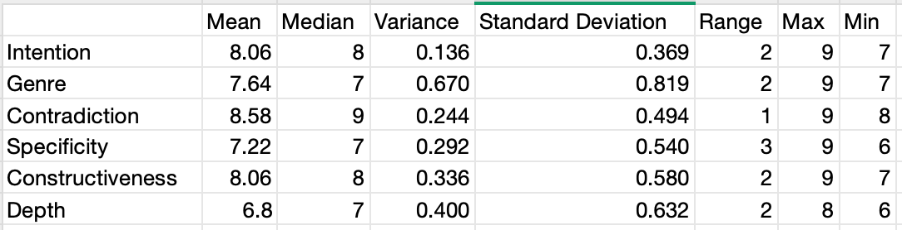
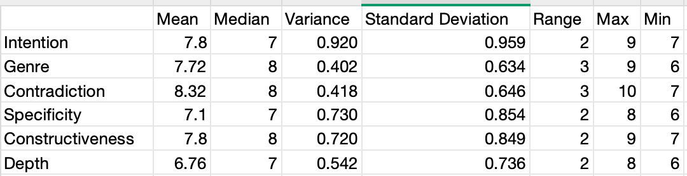
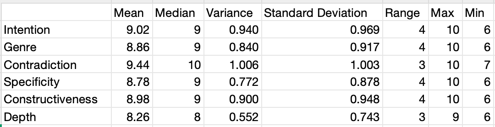
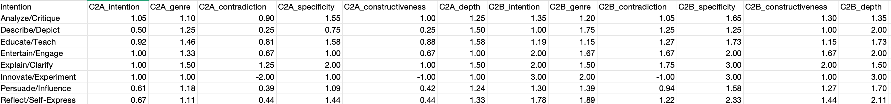

## 创作动机
分为10类：      
1. Explain/Clarify
2. Educate/Teach
3. Persuade/Influence
4. Entertain/Engage
5. Analyze/Critique
6. Describe/Depict
7. Reflect/Self-Express
8. Solve Problems
9. Preserve/Record
10. Innovate/Experiment
    
实际操作中，给author agent规定每个类别明确的instruction，让author agent输出创作动机所属的分类：
1. Explain/Clarify
    To define or simplify complex ideas
    To provide factual information
2. Educate/Teach
    To share knowledge or practical skills
    To instruct (e.g., tutorials, guides)
3. Persuade/Influence
    To change opinions or beliefs
    To advocate for action or policy
4. Entertain/Engage
    To tell stories (fiction/non-fiction)
    To amuse through humor or creativity
5. Analyze/Critique
    To evaluate theories, works, or systems
    To highlight strengths/weaknesses
6. Describe/Depict
    To create vivid imagery or atmosphere
    To detail settings, characters, or objects
7. Reflect/Self-Express
    To process personal thoughts or emotions
    To share philosophical/autobiographical insights
8. Solve Problems
    To offer solutions (technical, academic, etc.)
    To troubleshoot challenges
9. Preserve/Record
    To archive history, culture, or events
    To memorialize people/traditions
10. Innovate/Experiment
    To break traditional rules or formats
    To test new styles or speculative ideas

使用的数据集为 ASAP（50篇）+ ivypanda（50篇）

所用数据集上Z的分布：
{'Explain/Clarify': 4,
 'Educate/Teach': 26,
 'Persuade/Influence': 33,
 'Entertain/Engage': 3,
 'Analyze/Critique': 20,
 'Describe/Depict': 4,
 'Reflect/Self-Express': 9,
 'Solve Problems': 0,
 'Preserve/Record': 0,
 'Innovate/Experiment': 1}

在ASAP+ivypanda混合数据集（N=100）中，动机分布呈现长尾特征：

主导类别为Persuade/Influence(33%)和Educate/Teach(26%)
Innovate/Experiment(1%)等创新类样本稀缺
Solve Problems类、Preserve/Record类完全缺失

## 实验
### 部分实验数据
对“评价”的评价维度：
1. Intention: The feedback aligns with author's original intention of composing the essay, and the advice is provided to enhance that intention.(rate from 1 to 10)
2. Genre: The feedback fits the essay's genre and style.(rate from 1 to 10)
3. Contradiction: There are no contradictions between each category of feedback.(rate from 1 to 10, a higher score means less contradiction)
4. Specificity: Feedback provides detailed examples to support suggestions.(rate from 1 to 10)
5. Constructiveness: Feedback offers actionable steps (e.g., specific transitions, grammar fixes) for improvement.(rate from 1 to 10)
6. Depth: Feedback explores counterarguments and rebuttals to create balanced arguments.(rate from 1 to 10)

llm baseline:

llm multi-agents:

llm dabate:

### 作者意图协商机制

Author智能体基于预设的十类写作意图，首先解析输入文本的核心写作意图。例如，当检测到文本中存在非线性叙事结构与实验性语言风格时，Author代理将其归类为“创新实验”意图，并激活对应的辩护策略。根据prompt中的辩论协议，Author对专家建议执行三步评估：首先分析建议与意图的关联性，其次评估建议对核心意图的增强潜力，最后权衡修改可能导致的表达损失。

三位专家智能体（Content/Language/Structure）在每轮辩论中则需提供具体改进建议。辩论过程采用四阶段递进式协议：专家提出初始建议→作者澄清意图→专家补充证据→双方协商。

Integrator代理在最终整合阶段，通过双重验证确保建议与意图的一致性，考察每条建议与作者意图的相似度。

实验结果表示，Intention维度上，LLM baseline 8.06 → 多智能体 7.8 → 我的方法 9.02（+11.91%, +15.64%）,效果有所提升

### 动态流程控制和让步机制

Planner智能体识别文本的文体特征后，严格按prompt规定的格式生成评估顺序。例如，对检测为“议论文”的文本，输出标准化指令：[Evaluation Order]: 1. Content, 2. Structure, 3. Language [Terminate]。该顺序的确定遵循两个原则：首要评估对文体质量影响最大的维度，然后考虑维度间的依赖关系。Rubrics智能体此后解析评分标准，若用户未提供明确准则，则基于文体特征自动生成权重分配方案，并通过指令重写确保专家代理的建议范围符合预期。

期望通过这种方式，降低系统给出的作文改进建议中各个section的矛盾性

实验结果表示：

Genre维度上，LLM baseline 7.64 → 多智能体 7.72 → 我的方法 8.86（+15.97%, +14.77%）,效果有所提升

Contradiction维度上，LLM baseline 8.58 → 多智能体 8.32 → 我的方法 9.44（+10.02%, +13.46%），效果有所提升

### groupby intention category 看各个维度评价性能的变化

在不同的创作意图类别的文章中，我的方法对评价建议的提升效果较为类似。其中Innovate/Experiment类由于只有1条数据，偶然性较大。